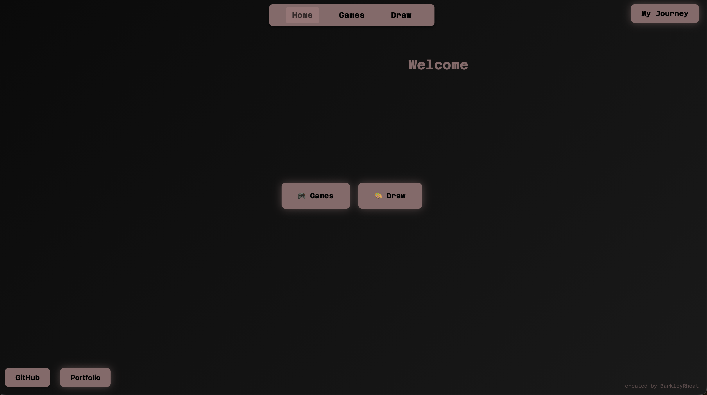
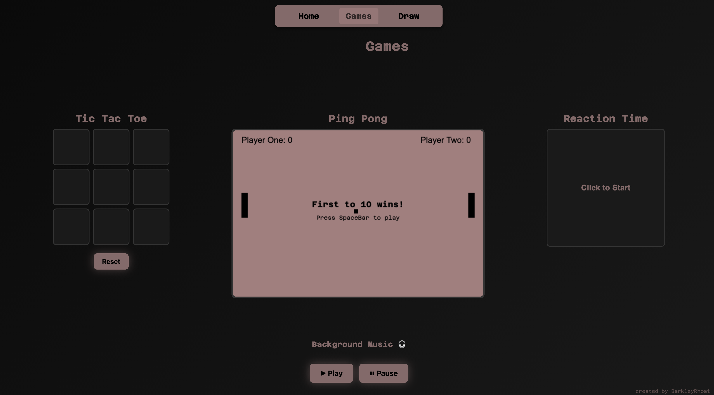
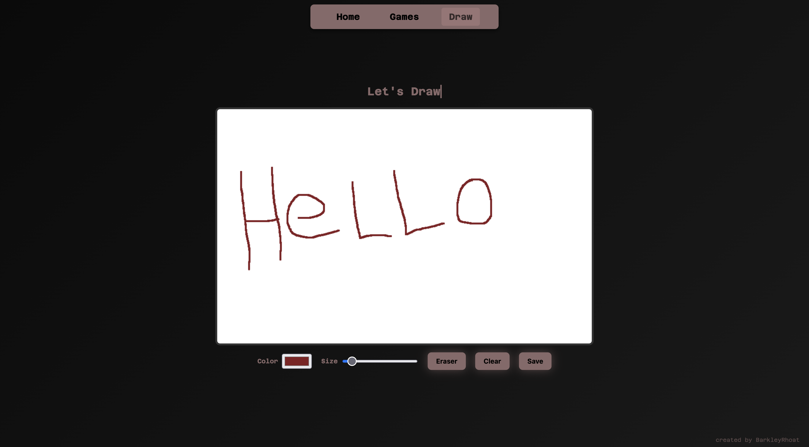

# PCA Project

## Description

A multi-page personal website built for PCA Pre-Work using vanilla HTML, CSS & JavaScript.

## Table of Contents

- [Description](#description)
- [About Project](#about-project)
- [Installation & Setup](#installation--setup)
- [Usage](#usage)
- [Contributors](#contributors)
- [Resources](#resources)
- [Testing](#testing)
- [Contact](#contact)

## About Project





### Built with

This project was built with

- JavaScript
- HTML
- CSS
- Google Fonts
- Canvas API (2D rendering for Ping Pong game and Draw Page)

## Installation & Setup

1. Clone the Repository:

```
git clone https://github.com/BarkleyRhoat/pca-project.git
```

2. Navigate into the project directory:
   ```
   cd pca-project
   ```
3. Open `index.html` in your browser:
   - **macOS:** `open index.html`
   - **Windows:** `Start index.html`
   - **Linux:** `xdg-open index.html`
   - Or simply drag and drop `index.html` into your browser window.

   No dependencies or build steps required - it's all vanilla HTML, CSS, and JavaScript

## Usage

### Home Page (`index.html`)

- Animated "Welcome" heading that rotates through multiple languages and orbits the screen.
- Home page cards linking to Games and Draw
- Mouse trail effect that follows your cursor.
- Footer links to GitHub and Portfolio.

### Games Page (`games.html`)

- **Tic Tac Toe** - Two player alternate clicking cells (X and O). Click "Reset" to start a new game.
- **Ping Pong** - Two player canvas game:
  - Player 1: `W` (up) / `S` (down)
  - Player 2: `Arrow Up` / `Arrow Down`
  - Press `Spacebar` to start
  - First to 10 Wins!
- **Reaction Time Test** - Click to start, wait for the box to turn green, then click as fast as you can. Your reaction time is displayed in milliseconds.

### Draw Page (`draw.html`)

- **Drawing Canvas** - a freehand drawing canvas with:
  - Color Picker to change brush color
  - Brush Size Slider
  - Eraser tool
  - Clear button to reset the canvas
  - Save button to download your drawing as a PNG
- Animated typewriter header effect

## Contributors

- [BarkleyRhoat](https://github.com/BarkleyRhoat)

## Resources

- [MDN Web Docs - Animation](https://developer.mozilla.org/en-US/docs/Web/API/Window/requestAnimationFrame)
- [W3 Schools @keyframes](https://www.w3schools.com/cssref/atrule_keyframes.php)
- [Mouse Trail Effect Tutorial](https://www.youtube.com/watch?v=ZotButrBGVI)
- [Ping Pong Tutorial](https://www.youtube.com/watch?v=IISA4XaE2gE)
- CoPilot helped with some ping pong logic.
- [ Canvas MDN Web Docs](https://developer.mozilla.org/en-US/docs/Web/API/Canvas_API/Tutorial)
- [Drawing App Tutorial](https://www.youtube.com/watch?v=mRDo-QXVUv8)

## Testing

No automated tests at this time. All features were manually tested in-browser.

## Contact

- GitHub: [BarkleyRhoat](https://github.com/BarkleyRhoat)
- Portfolio: [barkleyportfolio.netlify.app](https://barkleyportfolio.netlify.app/)

## License

This project is licensed under the [MIT License](./LICENSE).
